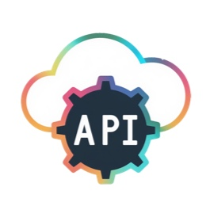

  

   

简体中文 | [English](README.md)

GrpcServer采用 gRPC（Google Remote Procedure Call）协议 构建轻量级、高性能的代理服务框架，基于 Protocol Buffers（protobuf） 接口定义语言进行通信接口建模，支持跨语言、跨平台的服务集成与调用。

### License

GrpcServer 使用非常宽松的MIT协议，请见 [License](https://github.com/ganweisoft/GrpcServer/blob/main/LICENSE)。

### 如何提交贡献

我们非常欢迎开发者提交贡献, 如果您发现了一个bug或者有一些想法想要交流，欢迎提交一个[issue](https://github.com/ganweisoft/GrpcServer/blob/main/CONTRIBUTING.md).
